

This repository contains C++ code that provides Gazebo plugins and models, CRCL XML parsing, robot planning control commanded by ROS custom messages based on CRCL,  for testing kitting planning based Gwendolen in simulation.



# Requirements



- Ubuntu 16.04 Trusty

- Gazebo 7 (to allow gazebo_ros_api packages)

- ROS  1 Kinetic

- CodeSynthesis, Xerces XML tools

- Java JDK 1.8 (Oracle)

# Installation

Clone the gzgwendolen repository and change to its main subfolder. Open a text window, and run the command:

	> ./rosbuild.bash 

This bash script contains a will check for required installations and if not found, install the packages, and then use 'catkin build' on all the packages. You should see a popup of build succeeded.

# Running

	> cd bin 
	>./E2E.bash  



Starting E2E script brings up a multi-tab gnome-terminal with ROS, Gazebo, Kin/Traj Shim, CrclApp, and debugging tabs: telnet and for rostopic. The following provides details on some of the primary diagnostic capabilities as the software can be brittle.

At first one sees the gnome terminal pop up with Gazebo splash screen:

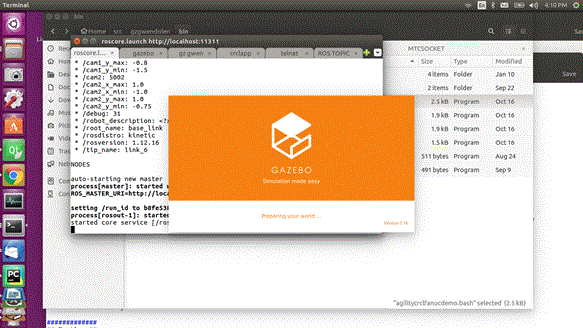

Note, that there is no way to coordinate waiting until ROS/Gazebo are fully enabled, so traj/kin shim and crclapp both use Sleep to wait a fixed amount until spawning the application. HOPEFULLY THIS IS SUFFICIENT SLEEPING TIME. Even though the apps wait and retry to connect to ROS and Gazebo, issues happen.  Since we are running on a underperforming PC we will assume the sleep amounts are sufficient. Next, we will show each tab in the gnome-terminal.

The first gnome tab is roscore which brings up ROS. 

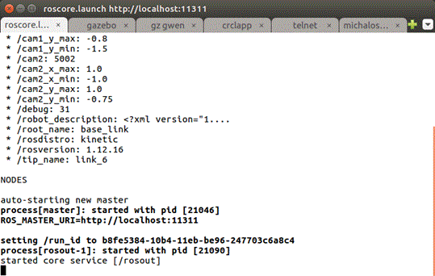

The parameters need to be removed and are legacy camera adjustments. However, you will note that the Gazebo screen shot contains two overhead cameras.

Next, is the Gazebo 7 simulation screen, which TAKES A LONG TIME TO FULLY LOAD.

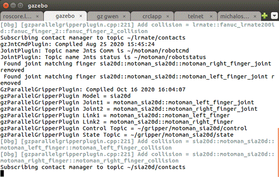

A bunch of plugin diagnostic information is displayed for both the Fanuc and Motoman robots. Seeing the diagnostic information is a good then. Often, Gazebo will abort for various reasons. 

Next is the Kin/Traj shim (replacing ROS moveit) that accepts custom ROS messages converted from CRCL (hence the need for ROS core). The module has several dependencies: ROS Kinematic, Gazebo 7, gotraj DLL, assimpl, boost dl, Google protobuf, and Gnu readline.  Most of these dependencies should already have been installed when building the E2E demonstration. The boost DLL plugin can be especially problematic, however, the goal was plugins for robot kinematics since numerous schemes exist with varying good qualities but no clear winner. For the Fanuc, the ikfast kinematic solution from ROS was adapted. For the Motoman, the gomotion serial kinematic solution was used. 

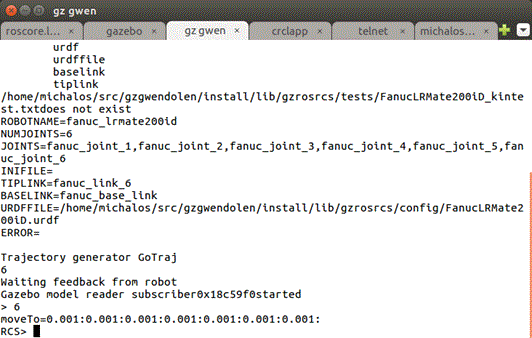

The console can handle numerous diagnostics but is kept as a legacy debugging tool

Next, the crclapp handles the CRCL input/output from clients as well as providing ROS message to the Kin/Traj shim.  

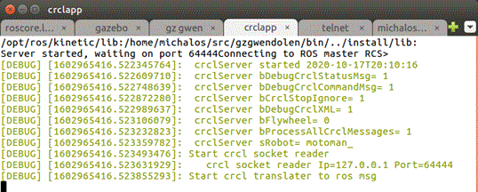

The crclapp tab displays its configuration. (This configuration is defined in config.ini in the config folder under the crclapp in the ROS install hierarchy.) crclapp handles CRCL communication and ROS topic communication. It now supports multiple CRCL clients so that telnet can be used as a diagnostic tool to see command/status communication from a supervisory CRCL client (in this case the planner). Likewise the ROS topic communication can be monitored using 'rostopic echo' while communication is occurring. This is helpful in establishing that the communication channels are indeed working. 

To assist the user, both a telnet of the CRCL communication channel and a rostopic echo of the ROS communication are provided as tabs in the  gnome-terminal.

A telnet is established to monitor CRCL communication (hard coded to 127.0.0.1 64444) is the next gnome-terminal tab.

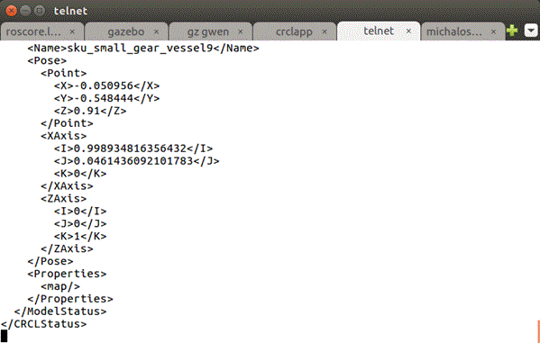

Next is the ROS enabled gnome tab, which allows for the 'rostopic echo fanuc_crcl_status' or 'rostopic echo fanuc_crcl_command' as shown below.

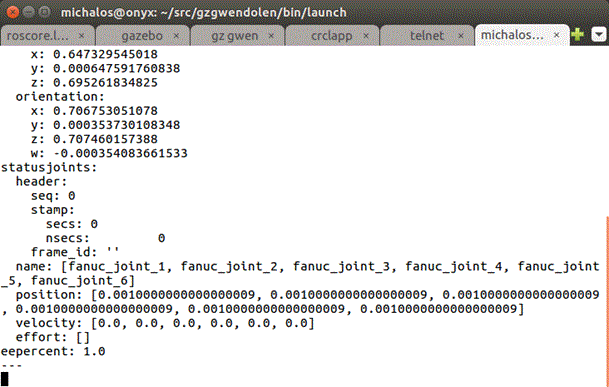

Finally, if you are patient, you should see the Gazebo simulation screen of the Agility Kitting setup with 2 robots, 2 cameras, desk, computers and walls. For expediency, some features of the agility were omitted so that Gazebo would load the simulation in a less agonizing amount of time.

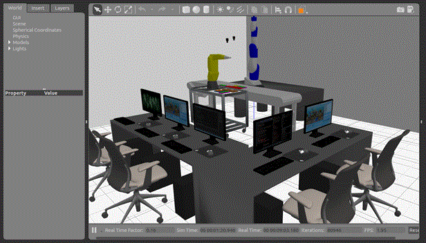



Using the crclapp tab you can further test whether the E2E script worked.

First, if you hit carriage return to get a RCS> prompt, enter "instances" to see what objects are being reports by the CRCL status with the new model extension.

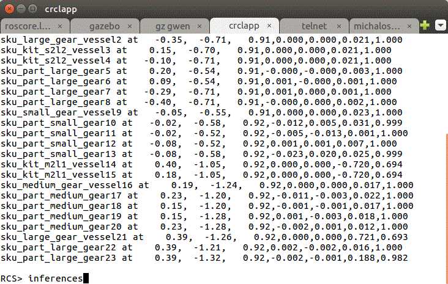

This output corresponds to the gears and trays in the Fanuc robots workspace (there are other gears and trays but are part of the Motoman workspace which is configured).

Next, inferences based on the instance relationships can be shown by hitting carriage return and entering "inferences". This command reports the all the trays (kits and supply vessels) slot occupancy. In addition, all gears are given there location (in what tray and slot). This capability is part of the crclapp inference engine. Output upon startup should show:

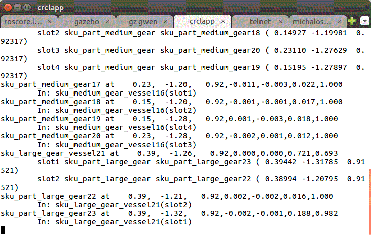



Next to test end-to-end communication, the 'auto' command in the crclapp should run the Fanuc robot through a complete kitting operation, as shown below.

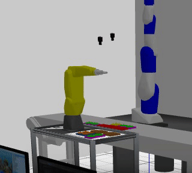

Only a portion of the Gazebo window is captured, but the idea of picking and placing gears from supply vessel into open kitting slots should correspond to what you see in invoking 'auto'. 

Once you encounter the  "No Free Gear in tray to move" diagnostic message as shown below:

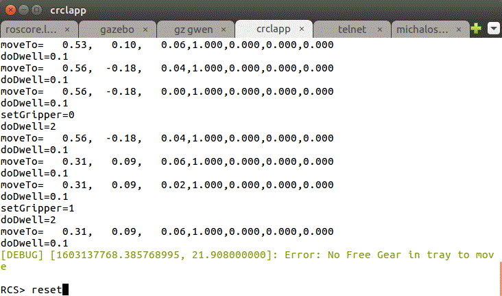

You can reset the gears back to their original positions, using the reset command.

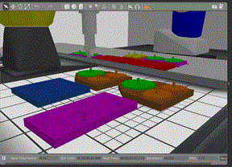

Gears move back to their original setup.

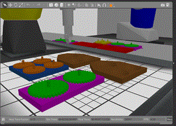

Note, currently the "auto" command is not as robust after reset, but this is being corrected.

## Configuration

Much of the CRCL configuration is done using an ini file. The name of the file is "config.ini" and is located under the crclapp in the config folder. It contains setup configuration for CRCL communication (expected units of operation – meters and radians) as well as flags for outputting diagnostic information to the crclapp gnome-terminal tab.



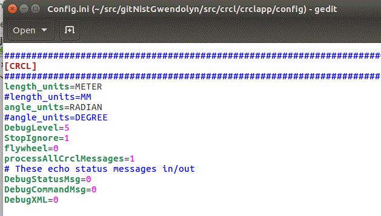



To modify the CRCL communication and crclapp CLI CRCL command echo, you will need to modify the robot ini section:

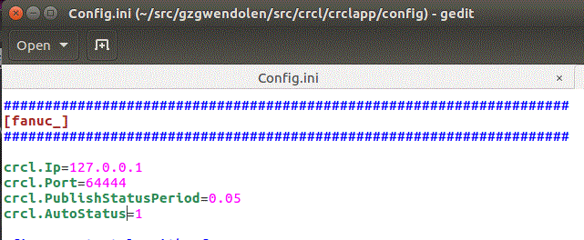

Where the IP and Port establish the CRCL host and socket, while autostatus enable/disables automatic CRCL status reporting.

## Implementation Notes

This is a brief summary of the components in the end-2-end Java Gwendolen planning to Gazebo kitting simulation. Shown below are 3 major components (Gazebo, Traj/Kin Shim called gzrosrcs containing gomotion trajectory generation, plugin kinematic solution, and ROS messaging), and the crclapp which handles CRCL and converts the various representations into ROS. Each of these modules is an application with numerous dynamic library (.so extension in Linux) dependencies, which can cause trouble. 





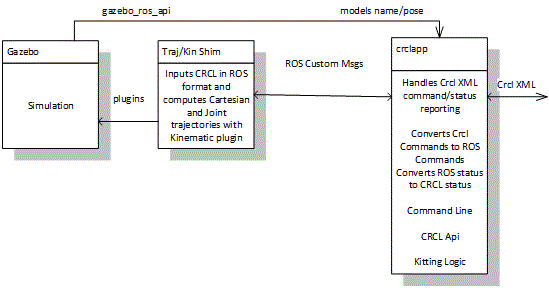



## Troubleshooting Notes

Eventually this section will list all the various problems that can happen. As is, hopefully an abort message in the gnome-terminal tab will be enough explanation.



